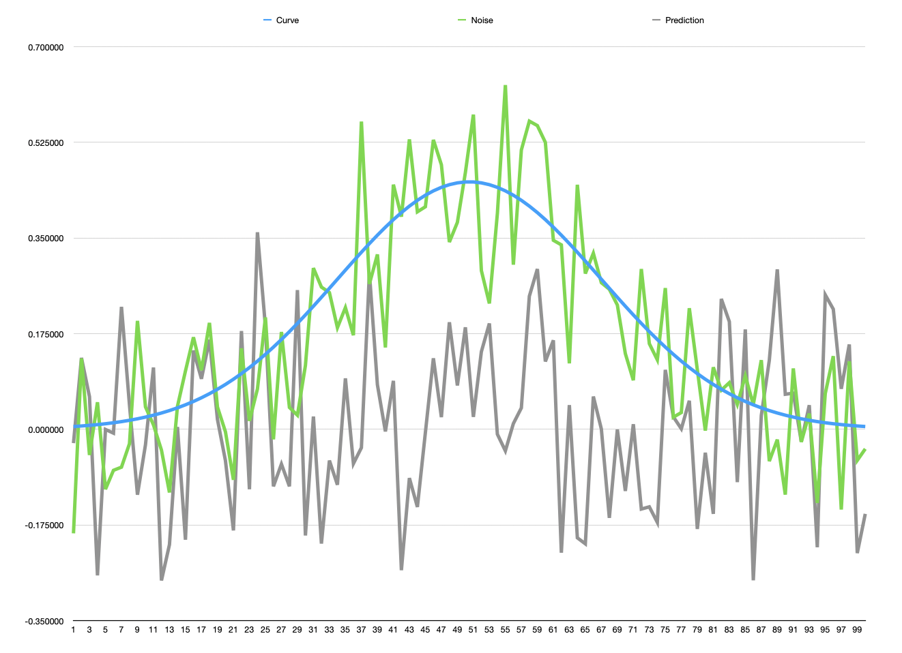

# Alice and Bob in the Land of Transformers

## Chapter 1

Bob was already at the cafe when Alice arrived. She saw him hunched over his phone, oblivious to the chatter and the hiss of coffee machines around him. As she approached, she glimpsed a wall of text on Bob’s phone. He didn’t even notice her.

“Talking to your virtual girlfriend, are we?” asked Alice, speaking very closely into Bob’s ear.
Bob jumped and looked up, startled.

“Hey, you scared me! And at least my virtual girlfriend doesn’t arrive late,” Bob said, still not fully seated after the jump scare.

“A lady is never late, nor is she early. She arrives precisely when she means to,” Alice said, taking her seat next to Bob. “Besides, there were delays on the Central line.”

“Yeah, whatever. And I was not talking to my virtual girlfriend,” Bob replied, his eyes back on the phone. “I was doing research.”

“Research?” Alice asked, with more mockery in her voice than she intended.

“Yes, research, Miss Wisegal! You’re not the only one who likes to ask questions, you know?”
Alice held up a hand. “Sorry,” she said, and leaned over to Bob’s phone. “What are you researching, then?”

“Well, this whole A.I. business. It feels like magic, and I would love to know how they do it.” Bob put his phone back on the table. “But it seems that asking an AI about how AI works is not very helpful.”

“Maybe you’re not asking the right questions,” Alice offered.

“Oh, yeah?” Bob said, looking straight at Alice. “What would you ask the AI, then? I bet you would say something like ‘My dear AI, can you ELI5 how your magnificent brain works, please?’”

Alice smiled. Bob knew her well and was aware that she was always polite to AI agents. Well, why shouldn’t she be? Politeness generates politeness, even if one’s talking to a machine.

“I would probably do something along those lines, yes, but I don’t need to, because I know how LLMs work.”

“Of course you do!” Bob said, folding his arms.

“Would you like me to explain it to you?”

Bob kept quiet for a while, looking at the phone.

“LL-what?” he asked finally.

“LLMs, Large Language Models. What powers many chat-based AIs, including your virtual girlfriend.”
Bob opened his mouth to speak, but Alice cut him off.

“I’m just teasing you, Bob!” she said, standing up. “Wait here. I’m going to grab myself a flat white, and we’ll discuss the wonderful world of Transformers.”

Alice placed her cup on the table and sat next to Bob. 

“I’ve just misheard, or you said the wonderful world of Transformers?” Bob said once Alice was seated. 

Alice looked at him and smiled.
“Yes, and you’ll soon find out that there’s more than meets the eye.” 

She removed the lid from her flat white, then reached for her bag and produced a notebook and a pen. She opened the notebook to an empty page and wrote ‘Transformers’

“So, what the heck is that Transformers thing?” Bob asked.

Alice started drawing in her notebook. “A Transformer is the heart of an LLM,” she started saying, while writing in the small rectangles she drew, “and it’s a blend of three things: embeddings, attention and MLP.”

“Okay…” Bob muttered.

“None of these components is new. The breakthrough was how they were put together. And for me, the best way to understand transformers is to work backwards — start with MLPs, and then see why the other pieces are needed.”

“If you say so.“ Bob shrugged.

Alice took a sip of her drink and looked around. The early morning busyness was already quieting down. _Perfect_, she thought, _my mouthfull words will not get lost in the chatter_.

“So, an MLP stands for Multi-Layer Perceptron”

“Gesundheit!”, Bob said.

“It’s a prediction machine — a well-informed crystal ball that predicts the future from patterns in the past, if you like,” Alice continued, ignoring Bob’s reaction. “What it does is basically say: ‘Given what I know and what you’re telling me, my best prediction is this.’”

“Just that?”

“Just that! Mathematically…”

“Oh, no!” Bob interrupted. “No, no, no. Don’t get all maths on me.”

“Breathe, Bob, I’ll be gentle, I promise,” Alice said, putting her hand on Bob’s shoulder. “After today, you’ll come to appreciate the poetry behind the maths notation.”
Bob didn’t look very convinced.

“Mathematically, as I was saying, it looks like this.” Alice wrote in her notebook and showed it to Bob.

$$f_\theta(x) = W_2 \, \sigma(W_1 x + b_1) + b_2$$

“Which is the same as saying: a bunch of weighted sums, a squish, and another weighted sum.”

“A squish?” asked Bob.

Alice made a squishing sound, miming the act of crushing an invisible object in her hand.

“Yes, Bob, a squish. Or, more technically, an activation function. A linear map, followed by an activation function, and finally another linear map,” she said, “And now, let’s look at each of these bits.”

Alice took a deep breath.
“Do you remember what a linear map is?”

“A linear map is…” Bob stopped, and he looked like he was digging inside his brain for something long buried. “A linear map is… a function that maps a domain to an image?” Bob said, almost like a whisper.

“Yep, that’s it.”

“I don’t know how I managed to remember that,” Bob said. “But what are we mapping here then?”

“We are mapping the problem, what we want to solve, into a feature space.”

“A feature space?” Bob asked.

“The space where the MLP actually does its thinking.”

“Not following, Alice.”

“Think of it as the number of neurons in a layer.”

“Neurons, like in human neurons?” Bob asked.

“Not quite like human neurons, but it’s a good analogy. To make it clearer, let’s look at an example.”
 Alice started writing a formula in her notebook. A formula she knew by heart. 

“Do you remember this?” she asked, turning the notebook towards Bob.


$$f(x) = \frac{1}{\sigma\sqrt{2\pi}} \exp\left( -\frac{1}{2}\left(\frac{x-\mu}{\sigma}\right)^{\!2}\right)$$

“Gaussian?” Bob said, his voice more of a shriek. “You know I still have nightmares with that dude.”

“Well, at least you quickly realised what it is, so that’s a start,” Alice said, “and the beauty of it makes it a perfect candidate to exemplify the whole MLP process.”

Bob sighed. 

“Imagine we have a plot of 100 points from a Gaussian distribution. For now, it really doesn’t matter what the mean and variance are, just that the count is 100.”

Alice drew the well-known bell curve of a Gaussian probability density function in her notebook.
“Now, imagine we have a noisy Gaussian distribution,” she said, while overdrawing a spiked line over the Gaussian curve, “and we want to reconstruct the underlying bell curve from it. How can we do this?” 

Alice took another sip of her drink, which was by now getting cold. It tasted bad in her mouth, and she wished she hadn’t got lost in explanations. But then again, the matter was exciting to her.

“I bet you’re about to tell me that that’s the job of the MLP”, Bob said with a sneer.

“Right on target. That’s exactly the purpose of the MLP. It will take a noisy function and predict the underlying Gaussian.”

“Predict?” Bob asked.

“Yes, predict. Remember that this is a crystal ball, after all. The best it can do is tell you what it thinks the underlying function is. And to make it even clearer, let me grab my laptop and show you.”

Bob got up. “Do you want something in the meantime?”

“I would love another flat white. This one ran cold.”

“Be right back.”

_It’s funny_, Alice thought, _how these concepts feel so alien when in the end it’s maths doing its job. Well, maths and very clever algorithms_. She can’t wait to show Bob Adam, the magician.

“Here’s your flat white,” Bob said

“Cheers, Bob. Right on time. Here, take a look.”

Bob sat down and stared at her computer, where he saw a small snippet of code. 

```swift
self.net = Sequential {
    Linear(dim, hidden)
    ReLU()
    Linear(hidden, dim)
}
```

“Is this it?” Bob asked

“Very much so. Well, the heart of it, at least. You’ll see this little brain has some helpers, but apart from that, this is the smallest MLP you can write.”

Bob looked puzzled.

“Remember the map, squish, map thing? That’s what those lines of code are doing. The first linear, or layer, takes our 100 points and maps them onto the system’s so-called neurons. Something like, this number goes here, that number goes there. Nothing magical about it.”

“Ok,” Bob said. He was holding his drink, but it seemed he wasn’t interested in drinking it.

“Now comes the squishy bit. ReLU is what we call an activation layer. It takes the numbers in the feature space and applies a simple rule: negative values are set to zero. It is a nonlinear layer, which means that there’s no linear mapping between the input and the output.”

“Alice, English, please?”

“Ok. Imagine a bouncer at a party. As people arrive at the door, he looks at them, and he might say, ‘You’re not properly dressed, so you cannot enter.’ or ‘You look stunning, you may enter’.”

“So an activation layer evaluates the input and decides where to put it?” Bob asked.

“Something like that, yes. Just remember that this is a bunch of numbers and simple maths operations, such as addition and multiplication. Nothing magical. Nothing intelligent. Just arithmetic.”

“But that scrambles everything around,” Bob said.

“Exactly, and that’s really what we want. Without the activation layer, the input and output would be linear. It’s the activation layer that does the heavy lifting of squishing and turning and pointing to new directions.”

“So it’s like shuffling and distributing a deck of cards?” 

“That’s a good analogy,” Alice said.

“Ok, so what about the last linear bit? Is it taking those juggled numbers and mapping them back to our 100-point Gaussian?”

“Very good, Bob”, Alice said, a tinge of triumph in her voice. “You’re getting the hang of this.”

Bob smiled, finally noticing the cup in his hand, and took a sip.

“Ready to see it live?” Alice said. Not waiting for a reply, she typed a few commands on her laptop, which produced a chart.

“Here you go,” Alice said, with a mischievous look.



“What the heck is that?” Bob said, “Is that supposed to be the prediction?”

“It is the prediction, yes.”

“But that’s… rubbish. Completely off. Either you’re mocking me, or we’re doomed if this is the best AI can do. Surely my virtual girlfriend, as you call her, is more coherent than that.”

Alice laughed. She was expecting this reaction, which proved she was on the right track.

“It is rubbish, and the reason is that right now, our MLP knows nothing. We’ve built the brain, but we haven’t taught it anything yet. It’s a blank slate, without any prior knowledge. Your virtual girlfriend is coherent because she’s been trained.”

“So, this experiment is a dumb crystal ball,” Bob said.

“It is indeed a dumb crystal ball.”
Bob stared at the messy prediction again.

“So how do we make it smarter?”

“Ah, that’s what we are about to see. But first, let’s grab some food because I’m starving. After that, I’ll introduce you to Mr Adam.”

“Who’s that?” 

“Food, Bob. Food.”


